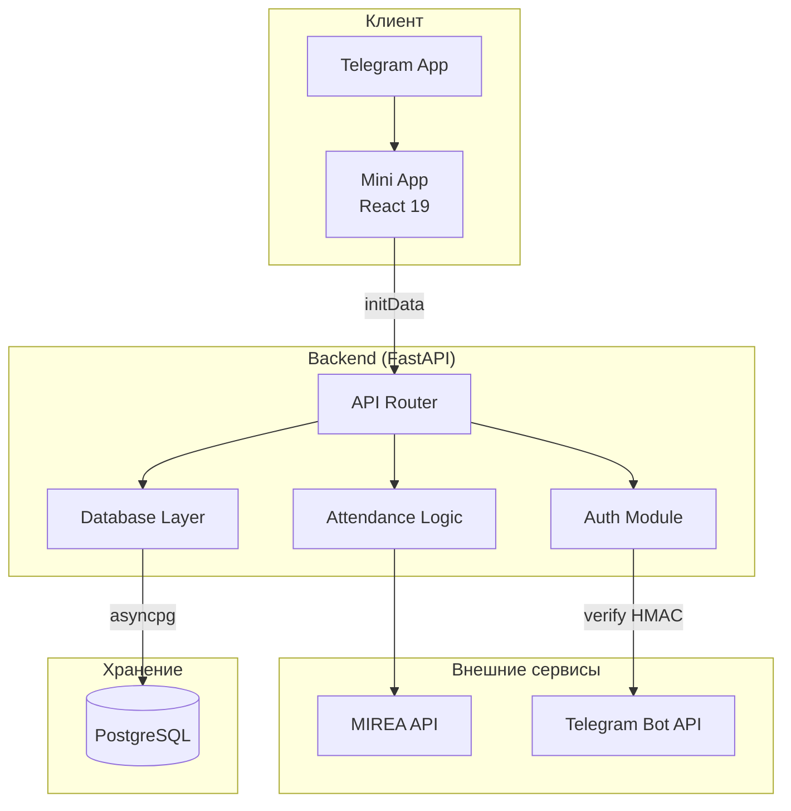
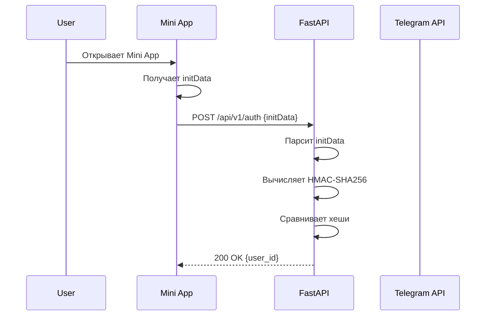
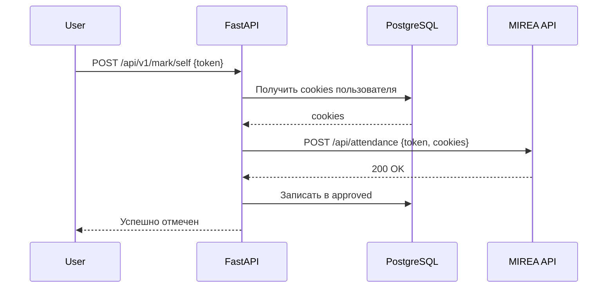

# Архитектура MireApprove

## Обзор системы



## Компоненты

### Frontend (telegram-mini-app)

```
src/
├── App.jsx                 # Точка входа, роутинг
├── components/
│   ├── MainScreen.jsx      # Главный экран
│   ├── LoginForm.jsx       # Форма входа
│   ├── ScheduleScreen.jsx  # Расписание
│   ├── MarkSelfScreen.jsx  # Самоотметка
│   └── ui/                 # shadcn/ui компоненты
└── services/
    ├── apiService.js       # HTTP клиент
    └── pointsService.js    # Сервис БРС
```

### Backend

```
backend/
├── main.py                 # FastAPI app, роутеры
├── config.py               # Переменные окружения
├── database.py             # DBModel с шифрованием
├── auth.py                 # Верификация Telegram initData
├── dependencies.py         # FastAPI dependencies
├── attendance.py           # Бизнес-логика посещаемости
│
├── base_endpoint_v1/       # /api/v1/* - базовые эндпоинты
├── admin_endpoint_v1/      # Админ функции
├── schedule_endpoint_v1/   # Расписание
├── points_endpoint_v1/     # БРС баллы
├── markin_endpoint_v1/     # Отметка других
├── nfc_endpoint_v1/        # NFC карты
├── tg_endpoint_v1/         # Telegram webhook
├── external_auth_endpoint_v1/  # External auth
│
├── attenApi/               # Интеграция с MIREA
│   ├── get_cookies.py      # Получение сессии
│   ├── get_schedule.py     # Расписание
│   ├── get_lesson_attendance.py
│   └── self_approve_attendance.py
│
└── decencproto/            # Protobuf декодеры
    ├── schedule_decoder.py
    └── improved_schedule_decoder.py
```

## Потоки данных

### Авторизация через Telegram Mini App



### Подтверждение посещаемости



## База данных

### Основные таблицы

```sql
-- Пользователи
users (
    tg_userid BIGINT PRIMARY KEY,
    group_name TEXT,
    login TEXT,
    hashed_password TEXT,  -- Fernet encrypted
    allowConfirm BOOLEAN,
    admin_lvl INTEGER,
    proxy TEXT,
    user_agent TEXT,
    fio TEXT
)

-- Записи о посещаемости
approved (
    id SERIAL PRIMARY KEY,
    tg_userid BIGINT,
    date TEXT,
    time TEXT,
    type TEXT,
    name TEXT
)

-- External auth токены
external_auth_tokens (
    token TEXT PRIMARY KEY,
    tg_userid BIGINT,
    status TEXT,  -- pending/approved/rejected
    service_name TEXT,
    created_at TIMESTAMP,
    expires_at TIMESTAMP
)
```

## Безопасность

### Шифрование паролей

```python
# database.py
def encrypt_password(self, password: str) -> str:
    return self.fernet.encrypt(password.encode()).decode()

def decrypt_password(self, encrypted: str) -> str:
    return self.fernet.decrypt(encrypted.encode()).decode()
```

### Верификация Telegram initData

```python
# auth.py
def verify_init_data(init_data: str, bot_token: str) -> int:
    # 1. Создать secret_key = HMAC-SHA256("WebAppData", bot_token)
    # 2. Вычислить hash = HMAC-SHA256(secret_key, data_check_string)
    # 3. Сравнить с полученным hash через hmac.compare_digest()
```

## Деплой

### Docker Compose

```yaml
services:
  postgres:
    image: postgres:15
    # Порт НЕ выставлен наружу

  app:
    build: .
    ports:
      - "8001:8001"
    depends_on:
      postgres:
        condition: service_healthy
```

### Переменные окружения

| Переменная | Описание | Обязательна |
|------------|----------|-------------|
| DSN | PostgreSQL connection string | Да |
| ENCRYPTION_KEY | Fernet ключ | Да |
| BOT_TOKEN | Telegram Bot Token | Да |
| BOT_USERNAME | Имя бота | Да |
| SUPER_ADMIN | Telegram ID админа | Да |
